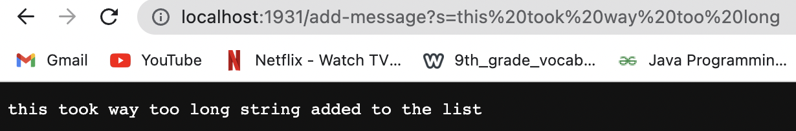

Part 1

```
import java.io.IOException;
import java.net.URI;
import java.util.List;
import java.util.ArrayList;

class Handler implements URLHandler {
    // The one bit of state on the server: a number that will be manipulated by
    // various requests.
    List<String> strlist = new ArrayList<>();

    public String handleRequest(URI url) {
            if (url.getPath().contains("/add-message")) {
                String[] parameters = url.getQuery().split("=");
                strlist.add(parameters[1]);
                return String.format(parameters[1]+" string added to the list");
            }
            return "404 Not Found!";
        }
}

class SearchEngine {
    public static void main(String[] args) throws IOException {
        if(args.length == 0){
            System.out.println("Missing port number! Try any number between 1024 to 49151");
            return;
        }

        int port = Integer.parseInt(args[0]);

        Server.start(port, new Handler());
    }
}
```


For the first screenshot, the method handleRequest was called. Since the url contained "add-message", the code was able to add my string "hi" to the list. The url was changed, therefore, the String array parameters was modified and the string was added to the strlist.


For the second screenshot, the method handleRequest was called. Since the url contained "add-message", the code was able to add my string "this took too long" to the list. The url was changed, therefore, the String array parameters was modified and the string was added to the strlist.


Part 2

testReverseinPlace Bug and Fix

Failure Inducing Input

```
	@Test 
	public void testReverseInPlace() {
    int[] input1 = {1,2,3,4};
    ArrayExamples.reverseInPlace(input1);
    assertArrayEquals(new int[]{4,3,2,1}, input1);
	}
```

Non-failure Inducing Input

```
	@Test 
	public void testReverseInPlace() {
    int[] input1 = {1,1,1,1,1};
    ArrayExamples.reverseInPlace(input1);
    assertArrayEquals(new int[]{1,1,1,1,1}, input1);
	}
```

Symptom


Bug

Before

```
  static void reverseInPlace(int[] arr) {
    for(int i = 0; i < arr.length; i += 1) {
      arr[i] = arr[arr.length - i - 1];
    }
  }
```

After

```
  static void reverseInPlace(int[] arr) {
    for(int i = 0; i < arr.length / 2; i += 1) {
      int new [] = arr[i]
      arr[i] = arr[arr.length - i - 1];
      arr[arr.length - i - 1] = new;
    }
  }
```

The bug was that the elements in the array were off when printing in reverse.
The fix incorporated a new method where the array length was divided by half as we need the elements after the halfway mark and created a new array that printed backwards.


Part 3

In labs 2 and 3, I learned how to run a server through a computer. I did know it was a concept that existed but have never tried utilizing the tool myself. Additionally, while running the server, through the lab I learned that if multiple attempts to try to connect to the same port at the same time and computer, there will be an error.
